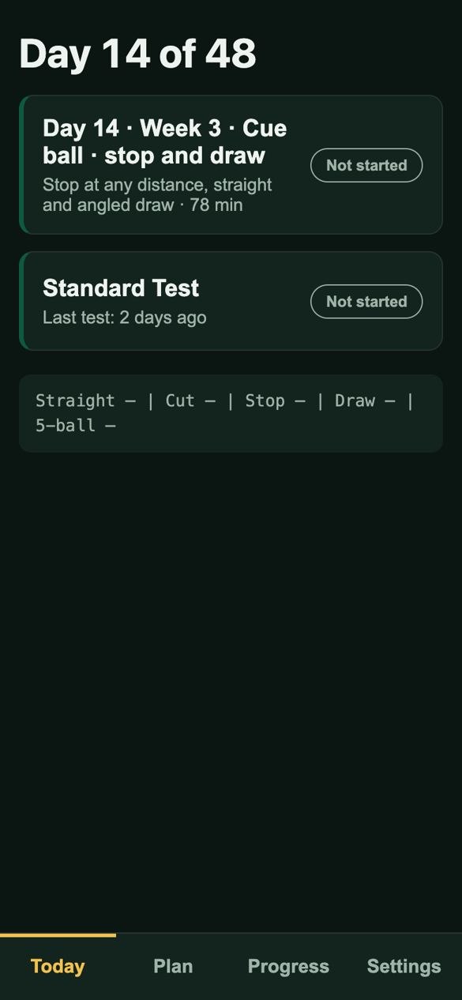
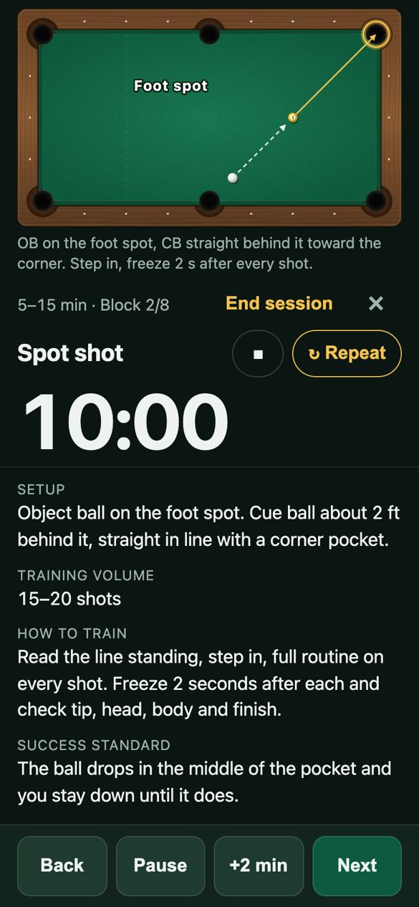
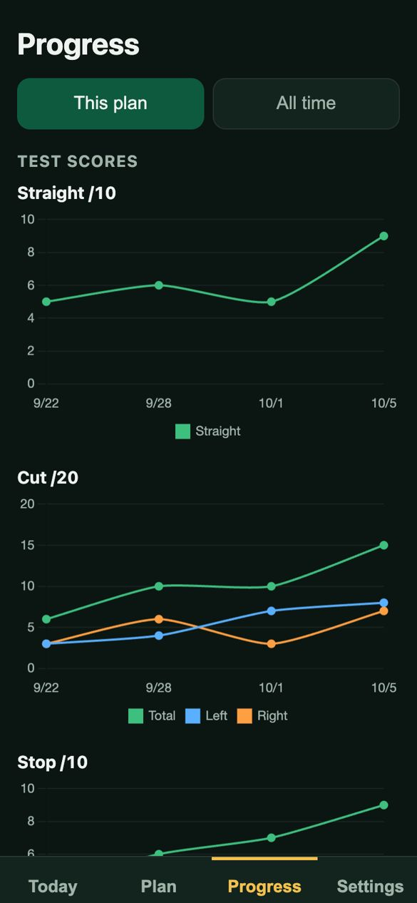
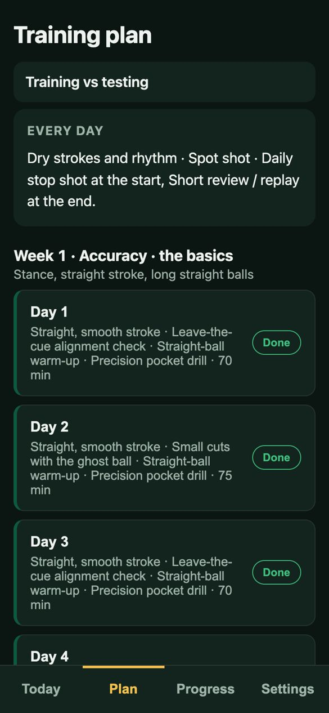
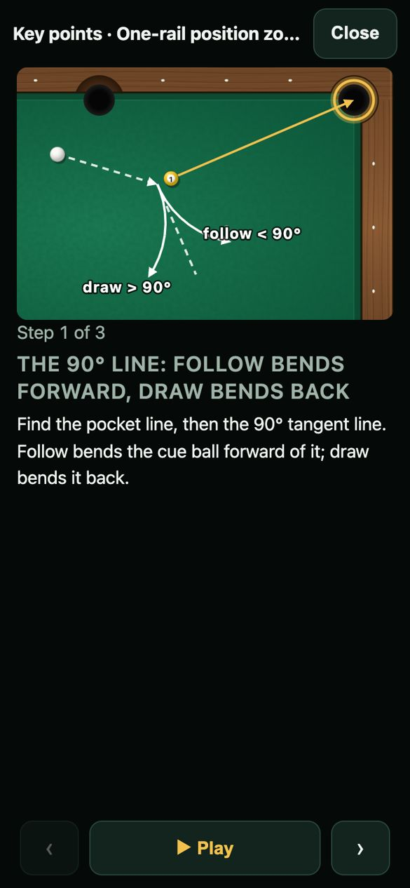
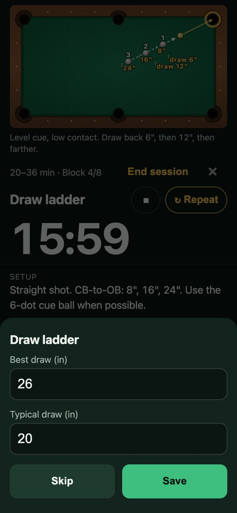
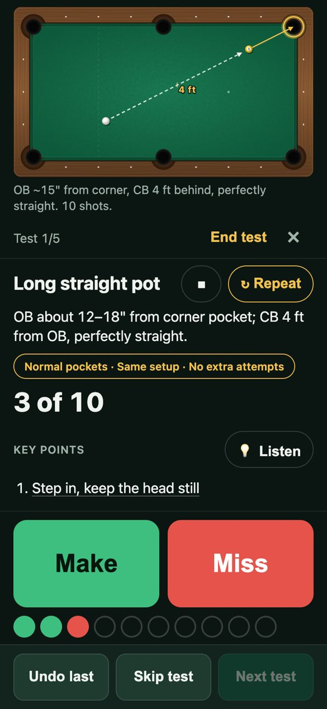
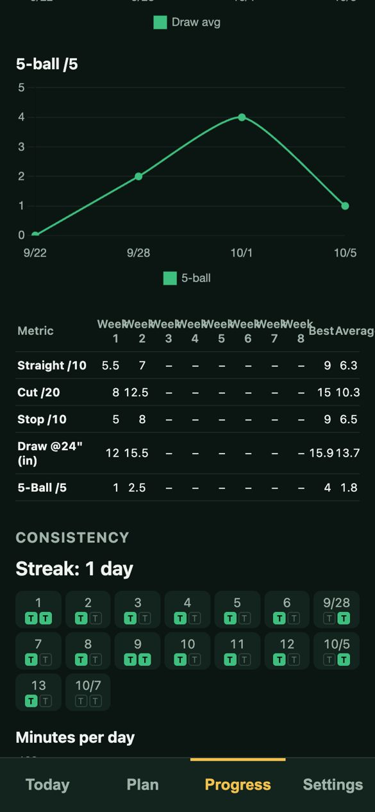
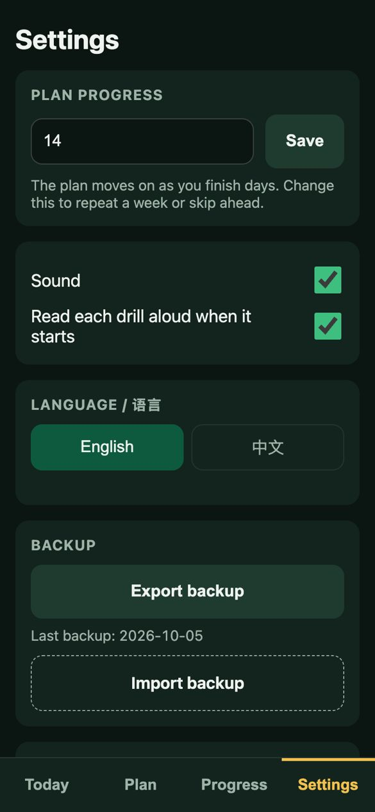
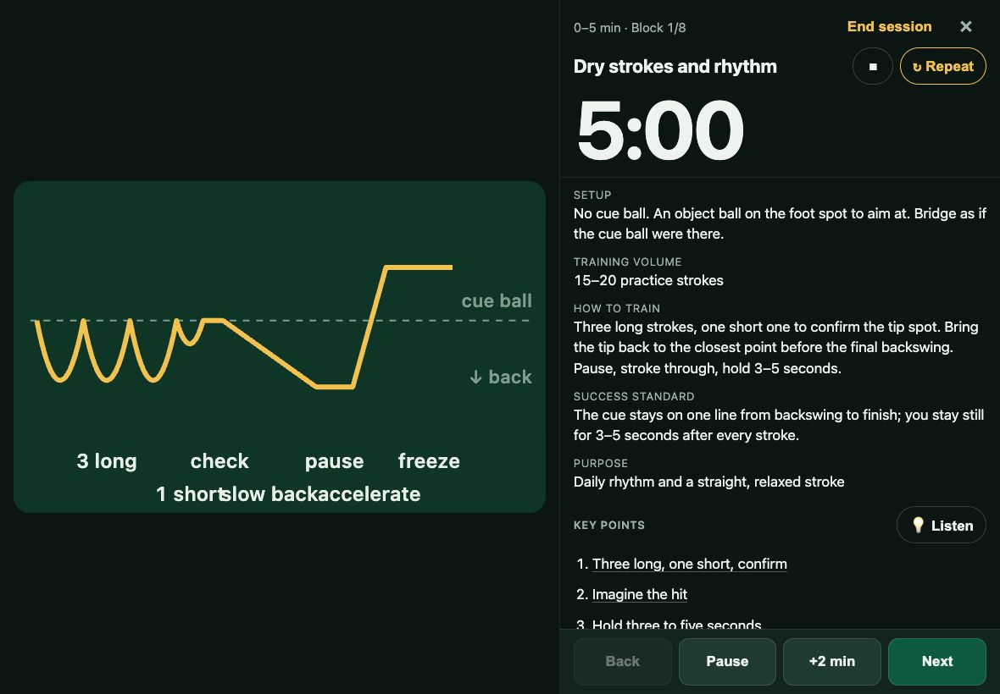

# Pool Training

**English** | [简体中文](README.zh-CN.md)

A phone and iPad app that guides an eight-week pool (billiards) training plan, one 60–90 minute session a day: a timed session guide with table diagrams and voice instructions, a standard skill test, and a progress log with charts. It works offline, and your records stay on your own device.

**Open the app:** https://li01.github.io/pool-training/

<p>
  
  
  
</p>

## Features

- **Eight-week progressive plan.** 48 training days, six a week, with the seventh for rest or the standard test. The content follows the three-day course by Pan Xiaoting: accuracy and the basics (weeks 1–2), cue-ball control (weeks 3–4), position play (weeks 5–6), then run-outs and the break (weeks 7–8). Every session starts with the same basics (dry strokes and rhythm, the spot shot, the stop shot) and ends with a short review.
- **Guided sessions.** Each drill has a countdown timer, a table diagram, setup, how to train, the success standard, and illustrated key points. A chime sounds when time is up.
- **Voice instructions.** Each drill is explained aloud when it starts, the way a coach would talk you through it, in a natural neural voice (English: Jenny, Chinese: Xiaoxiao). **💡 Listen** walks through the key points, one picture at a time. The clips are built in and play offline.
- **Standard test.** Straight pot ×10, cut shots ×20 (left/right), stop shot ×10, draw distance ×5, 5-ball clearance ×5. Tap Make or Miss; nothing else to fill in.
- **Progress.** Charts for each test, a weekly table, a training streak, and training records.
- **English and Chinese.** The whole app switches language, including drills, diagrams and voice. The Chinese version uses centimetres plus hand-width references (e.g. "about one palm").
- **Phone and iPad.** On an iPad in landscape, the diagram sits on the left and the instructions on the right.
- **Offline and private.** Once installed, it works without internet. All data is stored in the browser on your device; nothing is uploaded.

## Install on iPhone or iPad

1. Open https://li01.github.io/pool-training/ in **Safari** (it must be Safari on iOS).
2. Tap **Share** (the square with an up arrow).
3. Tap **Add to Home Screen**, then **Add**.

The app now has its own icon and opens full-screen. Open it once while online so everything, including the voice clips, is downloaded for offline use.

> The home-screen app keeps its own records, separate from the Safari tab. Train from the icon so all your records are in one place.

On Android, open the link in Chrome and choose **Install app** (or **Add to Home screen**) from the menu.

## How to use

### 1. Today




The home screen shows the next plan day (for example *Day 9 · Week 2 · Accuracy · harder shots*) and when you last took the standard test (it is due once a week). After the sixth day of a week it suggests a rest day or the test.

The line at the bottom is today's summary: the latest test scores.

The plan follows your progress, not the calendar: if you miss a day, you simply continue where you left off. The **Plan** tab lists all eight weeks and what each day trains; tap any day to repeat it or look ahead.

<br clear="right">

### 2. Run a training session




Tap the day's card, then **Start**.

- The top shows the drill's table diagram. Tap it to open it full-size.
- The big clock counts down the drill's time. **Pause**, **+2 min** and **Back** are at the bottom.
- The drill's instructions are read aloud when it starts. Tap **↻ Repeat** next to the title to hear them again from the start, or ■ to stop.
- Under the instructions, **Key points** lists the technique that matters most in this drill (stance, stroke rhythm, ghost-ball aim, the 90° tangent line, the two-halves rule, and so on). Tap **💡 Listen** to open an illustrated walkthrough: each point has its own picture and is read aloud, and the page turns by itself when one finishes. Tap a single point to read it without sound.
- Tap **Next** to move on to the next drill.

The screen stays on while a session runs. If you leave the app, the session is kept: the Today screen shows it as *In progress* and you can continue.

<br clear="right">

### 3. Record your results



Some drills ask for a result when you tap **Next**. For example, the draw ladder asks for your best and typical draw distance, and the 3-ball and 5-ball drills ask how many layouts you ran out.

Tap **Save**, or **Skip** if you did not keep count.

<br clear="right">

### 4. Take the standard test



Tap **Standard Test** on the Today screen, then **Start test**. For each shot tap **Make** or **Miss**.

Each test also has its own **Key points**; tap **💡 Listen** to hear them. **Undo last** removes the last shot. **Skip test** moves on if you can't do one today. Tap **↻ Repeat** to hear the test setup again. For the draw test, type the five measured distances.

Use the same setup each time: normal pockets, the same cue ball, no extra attempts.

<br clear="right">

### 5. Check your progress

<p>
  
  
</p>

The **Progress** tab shows:

- a chart for each test (straight, cut left/right, stop, draw average, 5-ball);
- a weekly table with averages for plan weeks 1–8, plus the best and average;
- your training streak, minutes per day, and training records (draw distance and pattern success rate).

Switch between **This plan** and **All time** at the top.

### 6. Settings



- **Plan progress**: the next day to train. Change it to repeat a week or skip ahead.
- **Sound**: the chime at the end of each drill.
- **Read each drill aloud when it starts**: automatic voice instructions on or off. **↻ Repeat** still works when it is off.
- **Language / 语言**: English or 中文.
- **Backup**: export or import all your records (see below).
- **Review all diagrams**: every table diagram on one page.
- **Reset all data**: tap twice to confirm.

<br clear="right">

### iPad

On an iPad in landscape, the diagram fills the left side and the instructions sit on the right, so you can read the setup from a distance:



## Back up your records

Records are stored only in this browser on this device. iOS may clear the data of web apps that go unused for a long time, and deleting the home-screen icon erases it.

- **Export:** Settings → **Export backup**. On iPhone/iPad, choose **Save to Files** (for example iCloud Drive). Do it about once a week.
- **Restore or move to a new device:** Settings → **Import backup** and pick the file. This replaces the records on that device.

## Development

Built with Vite, Preact and TypeScript; data in IndexedDB; offline support through a service worker (vite-plugin-pwa).

```bash
npm install
npm run dev      # dev server at http://localhost:5173/pool-training/
npm test         # vitest (watch); use `npx vitest --run` for one pass
npm run build    # type-check + production build into dist/
npm run preview  # serve dist/ to try the PWA/offline behaviour
```

### Editing content

- **Training plan**: `src/plan/plan.json` (English) and `src/plan/plan.zh.json` (Chinese).
- **Voice clips**: after changing plan text, run `scripts/make_voice.py` (needs `edge-tts`) to re-record the spoken introductions in `src/voice/`. A test fails while any clip is out of date; until then the app reads that drill with the device voice.
- **Drill diagrams**: `src/diagram/diagrams.ts`; Chinese titles, captions and labels in `src/diagram/diagrams.zh.ts`.
- **UI text**: `src/i18n/en.ts` and `src/i18n/zh.ts`.
- **Table size**: measure your real table and update the `TABLE` constant in `src/diagram/table.ts` (playing surface in inches, nose to nose).
- **Icons**: `scripts/make_icons.py` regenerates `public/icons/*` (needs Pillow).

### Deploy

Pushing to `main` runs `.github/workflows/deploy.yml`: tests, build, and publish to GitHub Pages (Pages source: "GitHub Actions"). The app is served under `/pool-training/`.
