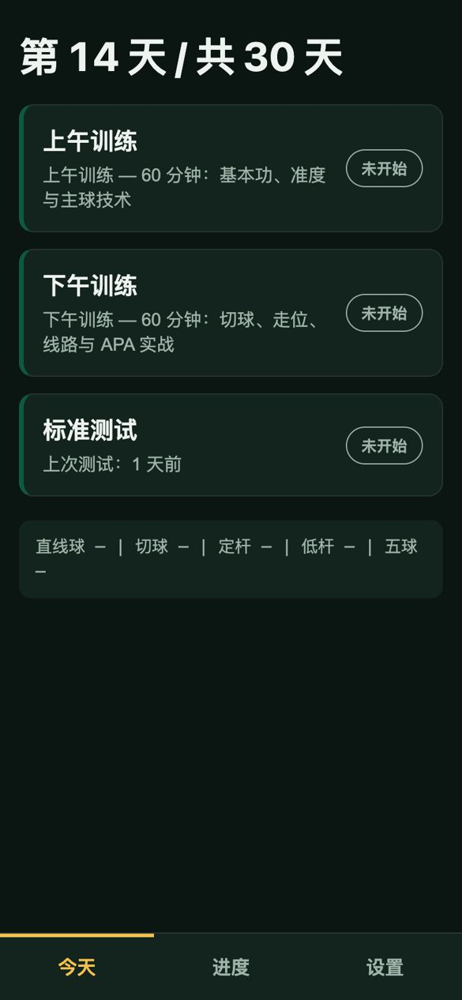
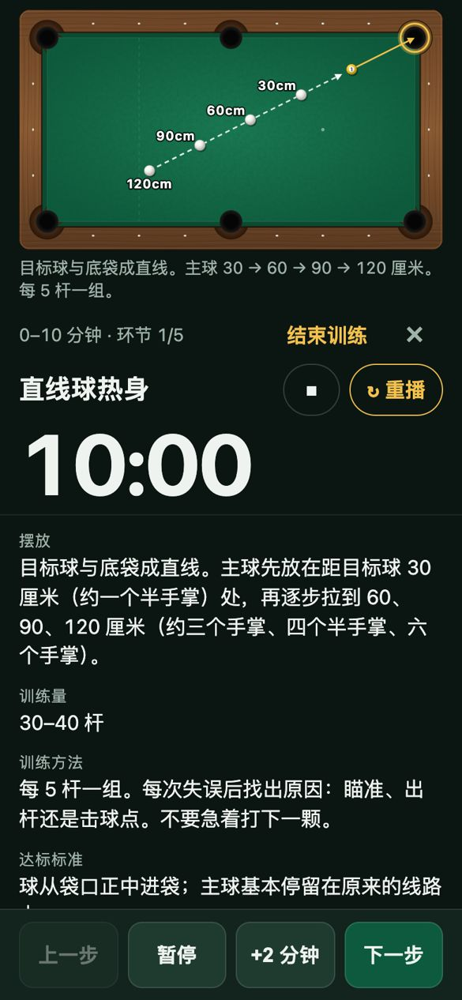
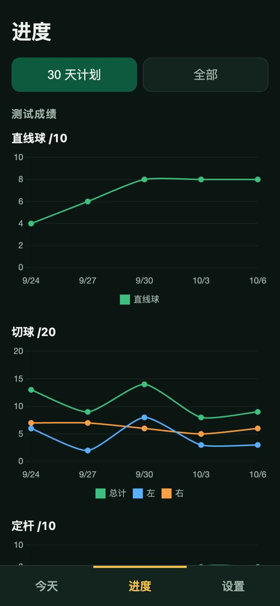
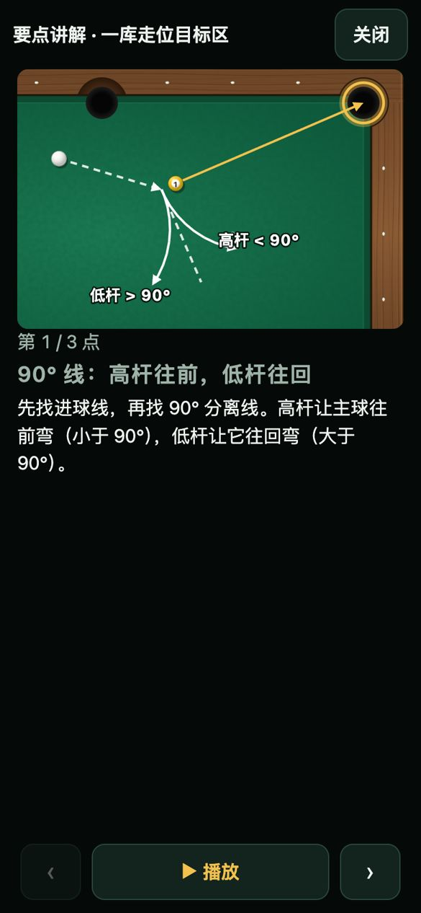
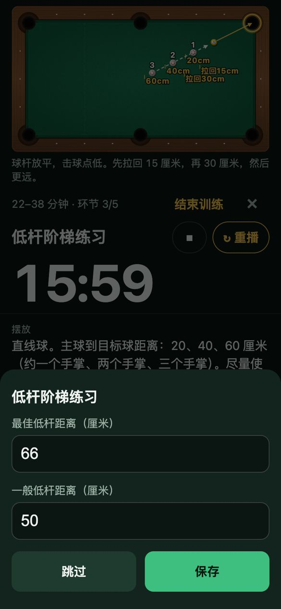
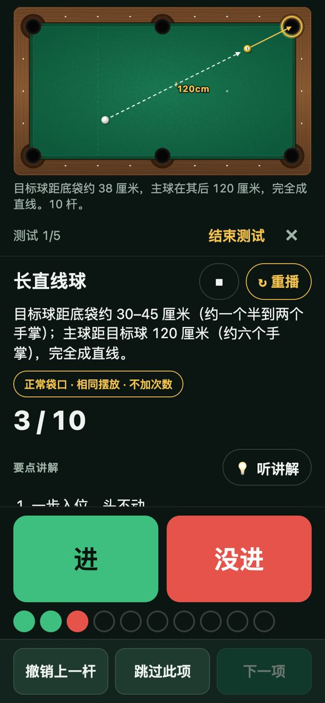
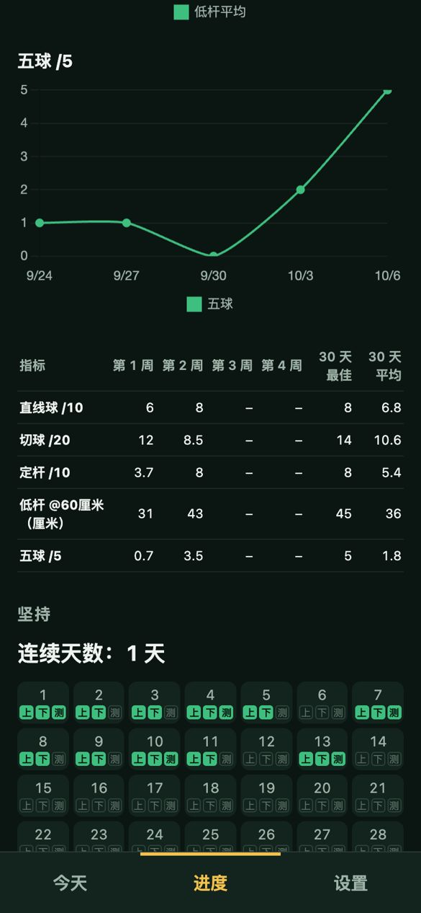
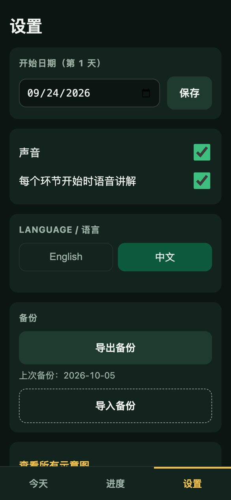
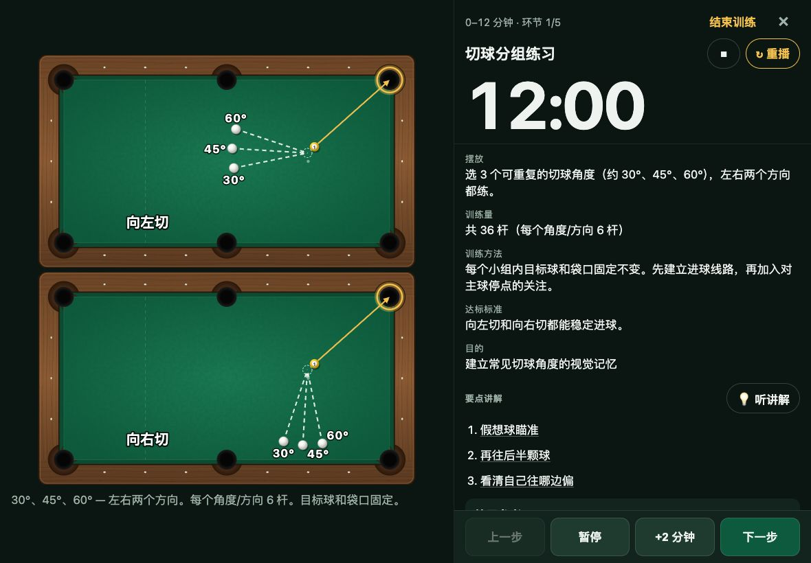

# 台球训练（Pool Training）

[English](README.md) | **简体中文**

一个用在手机和 iPad 上的台球训练 App，带你完成 30 天、每天 2 小时的训练计划：按时间引导每个训练环节（配球台示意图和语音讲解），做标准测试，并用图表记录进步。可以离线使用，所有记录只保存在你自己的设备上。

**打开 App：** https://li01.github.io/pool-training/

<p>
  
  
  
</p>

## 功能

- **30 天计划，每天 2 小时。** 上午 60 分钟练基本功（直线球、定杆/低杆/高杆阶梯、精准袋口），下午 60 分钟练实战（切球、一库走位、三球和五球线路、复盘）。
- **按环节引导训练。** 每个环节都有倒计时、球台示意图、摆放方法、训练方法、达标标准，以及图文「要点讲解」，时间到会响提示音。
- **语音讲解。** 每个环节开始时，像教练一样用口语把要做的事讲一遍，使用自然的神经网络语音（中文：晓晓，英文：Jenny）。点 **💡 听讲解** 会配着图一页一页讲要点。音频内置在 App 里，离线也能播放。
- **标准测试。** 长直线球 ×10、切球 ×20（左右各半）、定杆 ×10、低杆距离 ×5、五球清台 ×5。每杆只要点「进」或「没进」，不用填别的。
- **进度记录。** 每项测试的趋势图、每周汇总表、连续训练天数和训练记录。
- **中英文切换。** 整个 App 都能切换语言，包括训练内容、示意图和语音。中文版使用厘米，并附上用手比的参考（比如「约一个手掌长」）。
- **手机和 iPad 都适配。** iPad 横屏时，示意图在左边，讲解在右边。
- **离线、隐私。** 安装后不用联网也能用。数据只存在你设备的浏览器里，不会上传。

## 安装到 iPhone 或 iPad

1. 用 **Safari** 打开 https://li01.github.io/pool-training/（在 iPhone/iPad 上必须用 Safari）。
2. 点 **分享** 按钮（带向上箭头的方框）。
3. 点 **添加到主屏幕**，再点 **添加**。

主屏幕上就有了 App 图标，点开是全屏的。第一次请在联网时打开一下，让包括语音在内的所有内容下载好，之后就能离线使用。

> 主屏幕图标打开的 App 和 Safari 里的网页各自保存记录，互不相通。请固定从图标打开训练，这样记录都在一个地方。

安卓手机：用 Chrome 打开链接，在菜单里选 **安装应用**（或 **添加到主屏幕**）。

## 使用方法

### 1. 今天


首页显示今天是 30 天计划的第几天、上午和下午的训练，以及上次做标准测试是几天前（每 3 天应做一次）。

最下面一行是今天的小结：最近一次测试的成绩。

如果不是从今天开始的，可以在 **设置** 里改开始日期；不设置的话，第 1 天就是你第一条记录的那天。

<br clear="right">

### 2. 进行训练




点 **上午训练** 或 **下午训练**，再点 **开始**。

- 上方是这个环节的球台示意图，点一下可以放大。
- 大号时钟是这个环节的倒计时。底部有 **暂停**、**+2 分钟** 和 **上一步**。
- 每个环节开始时会自动朗读讲解。点标题旁的 **↻ 重播** 从头再听一遍，点 ■ 停止。
- 讲解下面的「要点讲解」列出这个环节最关键的技术要点（站位入位、运杆节奏、假想球瞄准、90° 分离线、二分法等）。点 **💡 听讲解** 打开图文讲解：每个要点配一张图并读出来，讲完自动翻到下一页。点某一条要点可以只看不听。
- 点 **下一步** 进入下一个环节。

训练进行时屏幕会保持常亮。中途离开 App 也没关系：「今天」页面会显示 *进行中*，点进去可以接着练。

<br clear="right">

### 3. 记录成绩



有些环节在点 **下一步** 时会让你记录成绩。比如低杆阶梯练习要填最佳和一般的拉回距离（厘米），三球和五球练习要填成功清台几次。

点 **保存**；如果没有计数，点 **跳过**。

<br clear="right">

### 4. 做标准测试



在「今天」页面点 **标准测试**，再点 **开始测试**。每一杆点 **进** 或 **没进**。

每项测试也有自己的「要点讲解」，点 **💡 听讲解** 可以听。**撤销上一杆** 可以删掉最后一杆。今天做不了某一项时，点 **跳过此项**。点 **↻ 重播** 可以再听一遍测试的摆放方法。低杆测试要输入 5 次实测的拉回距离。

每次测试请保持相同条件：正常袋口、同一颗主球、不额外加次数。

<br clear="right">

### 5. 查看进度

<p>
  
  
</p>

**进度** 页面包括：

- 每项测试的趋势图（直线球、左右切球、定杆、低杆平均、五球）；
- 每周汇总表：第 1–4 周的平均成绩，以及 30 天最佳和平均；
- 连续训练天数、每天训练分钟数，以及训练记录（低杆距离、线路成功率）。

页面顶部可以在 **30 天计划** 和 **全部** 之间切换。

### 6. 设置



- **开始日期（第 1 天）**：计划从哪天开始。
- **声音**：每个环节结束时的提示音。
- **每个环节开始时语音讲解**：自动朗读的开关。关掉后 **↻ 重播** 按钮仍然可以用。
- **Language / 语言**：English 或 中文。
- **备份**：导出或导入全部记录（见下文）。
- **查看所有示意图**：在一个页面里看全部球台示意图。
- **清除所有数据**：需要连点两次确认。

<br clear="right">

### iPad

iPad 横屏时，示意图占满左侧，讲解在右侧，站在球台边也能看清摆法：



## 备份记录

记录只保存在这台设备的这个浏览器里。iOS 可能会清除长期不用的网页 App 的数据，删除主屏幕图标也会把记录一起删掉。

- **导出：** 设置 → **导出备份**。在 iPhone/iPad 上选择 **存储到"文件"**（比如 iCloud 云盘）。建议每周做一次。
- **恢复或换新设备：** 设置 → **导入备份**，选择备份文件。这会替换该设备上现有的记录。

## 开发

使用 Vite、Preact 和 TypeScript；数据存在 IndexedDB；通过 service worker（vite-plugin-pwa）支持离线。

```bash
npm install
npm run dev      # 开发服务器：http://localhost:5173/pool-training/
npm test         # vitest（监听模式）；运行一次用 `npx vitest --run`
npm run build    # 类型检查 + 生产构建，输出到 dist/
npm run preview  # 本地预览 dist/，测试 PWA 和离线功能
```

### 修改内容

- **训练计划**：`src/plan/plan.json`（英文）和 `src/plan/plan.zh.json`（中文）。
- **语音讲解**：修改计划文字后，运行 `scripts/make_voice.py`（需要 `edge-tts`）重新录制 `src/voice/` 里的音频。有音频过时的时候会有测试报错；在重录之前，App 会用设备自带的语音朗读那一段。
- **示意图**：`src/diagram/diagrams.ts`；中文标题、说明和标注在 `src/diagram/diagrams.zh.ts`。
- **界面文字**：`src/i18n/en.ts` 和 `src/i18n/zh.ts`。
- **球台尺寸**：量一下你的球台，修改 `src/diagram/table.ts` 里的 `TABLE` 常量（台面尺寸，单位英寸，库边到库边）。
- **图标**：`scripts/make_icons.py` 会重新生成 `public/icons/*`（需要 Pillow）。

### 部署

推送到 `main` 会运行 `.github/workflows/deploy.yml`：运行测试、构建并发布到 GitHub Pages（Pages 来源设为 "GitHub Actions"）。App 部署在 `/pool-training/` 路径下。
